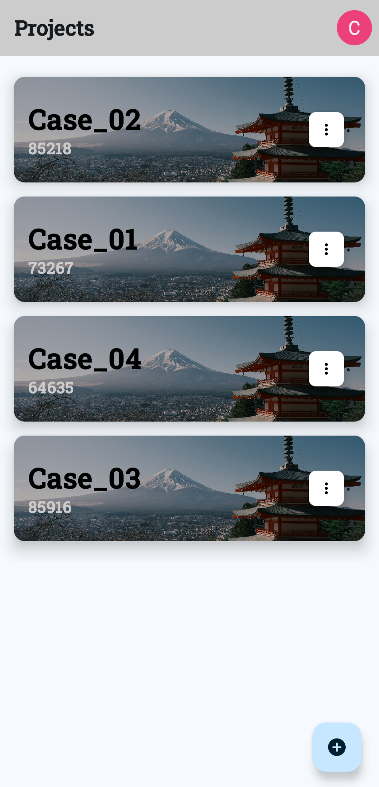
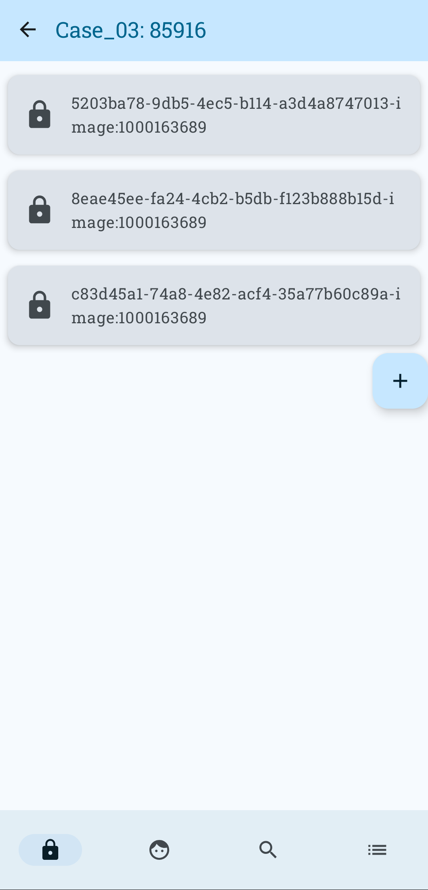
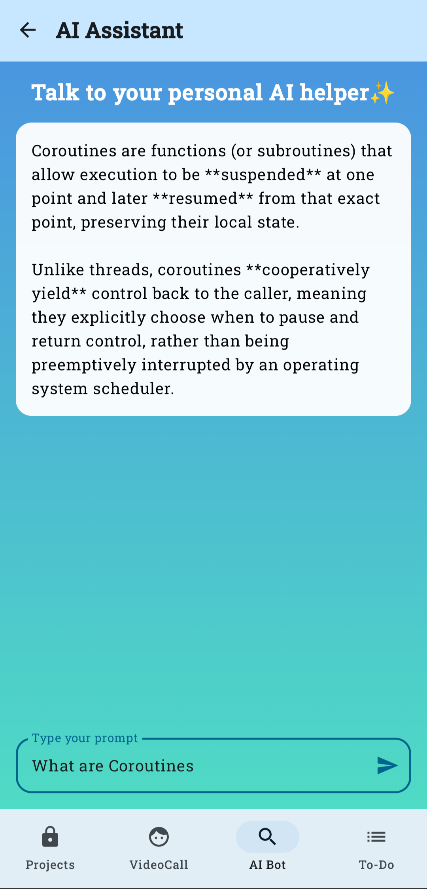
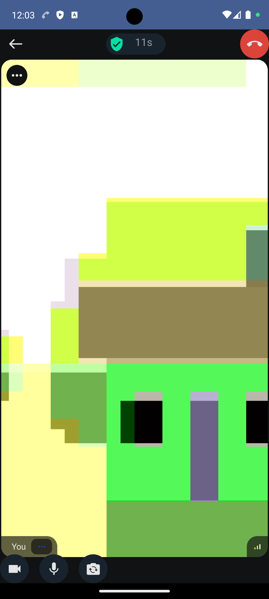
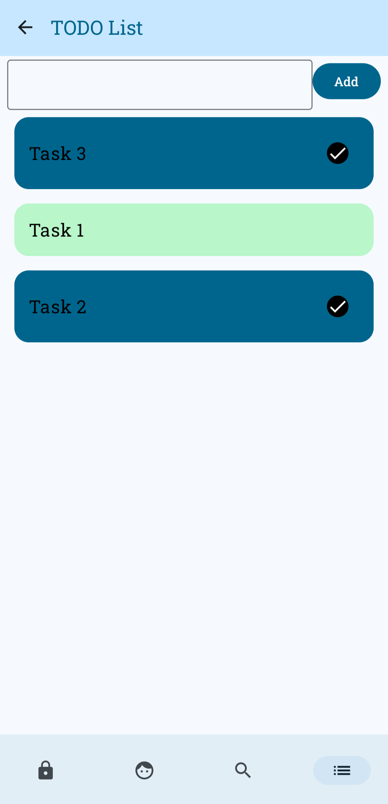

# 🟦 ProVault — Decentralized Collaboration & AI Productivity App

### 🔐 Secure • 🤖 Smart • 📁 Decentralized • 📞 Connected  
A modern Android app that brings together project collaboration, file storage, AI assistance, and real-time communication.

---

## 🏷️ Badges

---

## 🎞️ Demo Preview (GIF)

---

# 📦 Overview

ProVault is a next-generation productivity and collaboration app designed for secure digital workspaces.  
It combines decentralized file storage, smart AI assistance powered by **Gemini**, a built-in **video calling system**, and a clean **Jetpack Compose UI**.

It demonstrates how modern apps integrate:

- Cloud authentication  
- Decentralized IPFS storage  
- Real-time communication  
- AI model inference  
- MVVM & clean architecture principles  

---

# 🚀 Features

### 🔐 Authentication
- Google login  
- Biometric authentication  
- Protected navigation  

### 📁 Decentralized File Upload (IPFS + Pinata)
- Upload files to IPFS  
- Pin and retrieve using Pinata  
- Permanent & tamper-proof storage  

### 🤝 Project Collaboration
- Create project groups  
- Add members  
- Manage files, notes, and todos  

### 🤖 Gemini AI Assistant
- Ask questions directly inside the app  
- Fast, short, context-aware responses  

### 🎥 Video Calling (GetStream.io)
- Multi-participant calls  
- Real-time signaling  

### 📋 To-Do Manager
- CRUD operations  
- Smooth Compose UI  

### 🎨 Modern UI
- Material 3  
- Smooth animations
- Lottie integration  

---

## 📱 App Screenshots

### 🔐 Sign In Screen

### 🏠 Projects Dashboard

### 📁 File Upload & Retrieve

### 🤖 AI Assistant

### 🎥 Video Call Screen

### 🎥 Task List

---

# 🏗️ Tech Stack

### **Frontend**
- Kotlin  
- Jetpack Compose  
- Material3  
- Coil  
- Coroutines  
- Navigation Compose  

### **Architecture**
- MVVM  
- Repository pattern  
- UseCase layer  
- Clean, testable modules  

### **Backend + APIs**
- Firebase Auth  
- Firebase Firestore  
- Pinata IPFS API  
- Retrofit + OkHttp  
- Gemini 2.5 Flash  
- GetStream Call API  

---

# 👨‍💻 Author

## **Chandan Suryakant Bhopi**
**Android Developer • AI Enthusiast • Software Builder**

A passionate software engineer focused on building real-world, production-ready apps with Android, AI, and modern cloud technologies.  
Strong believer in project-based learning, clean architecture, and solving problems that actually matter.  
Always exploring new ideas, experimenting with emerging tech, and pushing to improve with every project.

### 🔗 Connect with me
- **GitHub:** https://github.com/Dem0nCyborg  
- **LinkedIn:** www.linkedin.com/in/chandan-bhopi-99191624a 
